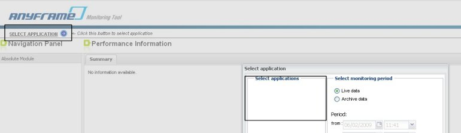
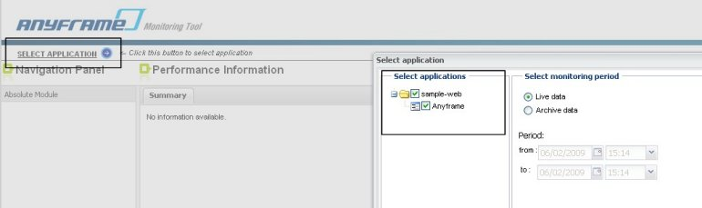

Anyframe Monitoring
===

#### 특징
* Performance Summary 기능을 통해 각 레이어에서 메소드를 실행하는데 소요된 총 시간, 평균 실행 시간, 실행 회수, 최소 실행 시간, 최대 실행 시간 및 call trace 정보 등을 볼 수 있다.
* SQL Summary 페이지를 통해 쿼리문 평균 수행 시간과 호출 빈도수를 기반으로 상위 5개의 query를 볼 수 있으며, 별도의 팝업을 통해 실제로 수행된 완전한 쿼리문을 볼 수 있다.

#### Quick Start

##### 설치 환경
Monitoring Tool은 아래와 같은 환경에서 동작 가능하도록 개발되었다.
* JDK 1.5 이상
* Web Container - Tomcat 5.5 이상, JEUS 5 이상, WebLogic 9.2 이상
본 문서에서는 기본적으로 Tomcat6.0을 기준으로 설치 가이드를 진행할 것이다. 이하 문서에서 [Tomcat Home] 이라함은 Tomcat 서버 설치 폴더를 지칭한다.

##### WAR 파일 배포
Monitoring Tool을 배포하는 방법에 대해 알아보도록 하자.

1. [Tomcat Home]\webapps 폴더 하위에 앞서 다운로드한 anyframe.tools.monitoring-x.x.x.war 파일을 옮겨 놓는다.
2. Tomcat 서버를 동작시키면 동일한 위치에 압축이 자동으로 해제될 것이다.

이외의 어플리케이션 서버에 대해서는 각 어플리케이션 서버 배포 방법에 맞게 다운로드한 WAR 파일을 배포하면 된다.

##### 실행 확인
Monitoring Tool이 정상적으로 실행되었는지 확인하는 방법에 대해 알아보도록 하자.

1. [Tomcat Home]\bin\catalina.bat 파일을 실행하여 Monitoring Tool을 시작시킨다.
2. Tomcat 서버가 정상적으로 시작되었는지 콘솔창을 통해 확인한다.
3. 브라우저 주소창에 http://localhost:8080/anyframe.tools.monitoring-1.0.0 을 입력하고, Anyframe Monitoring Tool 화면이 뜨는지 확인한다.
4. Anyframe Monitoring Tool의 좌측 상단 SELECT APPLICATION을 선택하였을 때, 모니터링 대상 어플리케이션을 선택할 수 있는 팝업창이 뜬다. 모니터링 대상 어플리케이션이 아직 실행되지 않았으므로 어플리케이션 목록이 조회되지 않을 것이다.

그림은 Anyframe Monitoring Tool이 정상적으로 시작되었을 때, 보여지는 웹화면입니다.  Anyframe Java MonitoringTool 웹화면에서 좌측 상단에 위치한 SELECT APPLICATION을 선택하였을 때, 모니터링 대상이 되는 어플리케이션을 선택할 수 있도록 팝업창이 뜬다. 모니터링 대상 어플리케이션이 아직 실행되지 않은 경우에는 어플리케이션 목록이 조회되지 않을 것이다.

##### 테스트 모니터링
Sample 웹 어플리케이션을 설치한 후 모니터링이 정상적으로 이루어지는지 테스트하기 위해 몇 개의 기능을 실행시켜 보도록 한다. (* 모니터링 대상 어플리케이션을 위한 속성 정의 및 모니터링 대상 정의를 위해서는 Monitoring 매뉴얼을 참고하도록 한다.)

1. Anyframe Monitoring Tool의 좌측 상단 SELECT APPLICATION을 선택하였을 때, 사용자의 컴퓨터 이름과 어플리케이션 이름이 나타나는 것을 알 수 있다.
2. 해당되는 어플리케이션을 선택하고 OK 버튼을 클릭하면 모니터링 결과를 확인할 수 있게 된다.

단, 모니터링 대상 어플리케이션이 참조하는 클래스패스에 infrared-agent-all-servlet-x.x.x.jar 파일이 추가되어 있어야 함에 유의해야 한다. infrared-agent-all-servlet-x.x.x.jar은 anyframe.tools.monitoring.agent-x.x.x.zip 파일 내에 포함되어 있다.

이외, Anyframe Monitoring Tool에 대한 자세한 사용법은 Monitoring 매뉴얼을 참고하도록 한다.

##### 리소스
Monitoring Tool은 오픈 소스 프로젝트 Infrared 2.4.1 Beta의 UI를 GWT로 개선을 하면서 메모리 누수와 관련된 버그를 Fix하였다.

* [Infrared 2.4.1 Beta] (http://infrared.sourceforge.net/versions/latest/)
